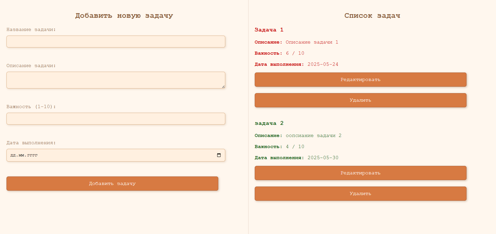
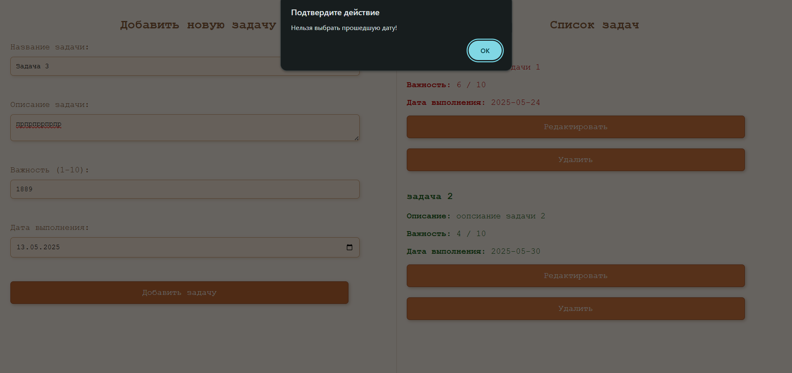
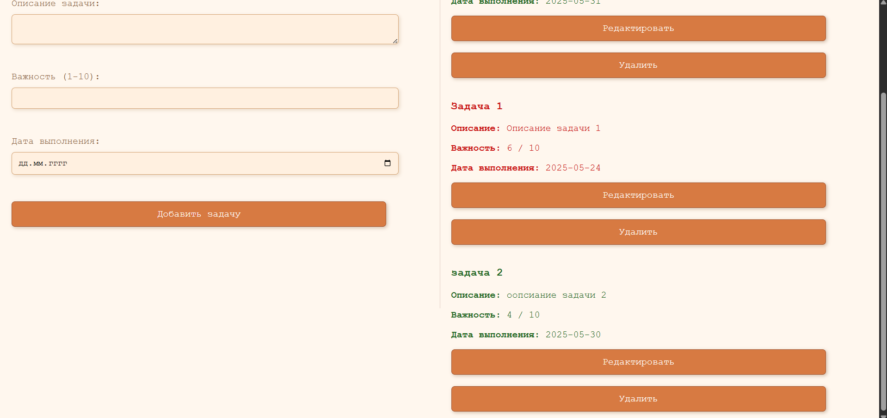

# Индивидуальная работа. To-Do List на JavaScript  
Борисенко Дарья, группа IA2403  

## Цель проекта  
Создание простого и удобного списка задач (To-Do List), позволяющего пользователю планировать дела, устанавливать приоритет, задавать дату выполнения, а также редактировать и удалять задачи.  

## Функции проекта  
В проекте реализован следующий функционал:  

- **Добавление новой задачи.**  
  Пользователь заполняет форму:  
  * название задачи  
  * описание  
  * уровень важности (от 0 до 10, автоматически ограничивается)  
  * дата выполнения (прошедшие даты запрещены)  

- **Удаление задачи.**  
  После нажатия на кнопку “Удалить”, задача удаляется из localStorage и интерфейса.  

- **Редактирование задачи.**  
  После нажатия на “Редактировать”, данные задачи автоматически заполняются в форму. Задача удаляется из списка, и при повторном нажатии “Добавить” — добавляется с обновленными параметрами.  

- **Отображение задач.**  
  Все задачи отображаются в правой части экрана. Задачи сортируются по важности (сначала более важные).  
  Если до выполнения задачи осталось 2 дня или меньше, она выделяется визуально (`red-tasc`). В противном случае применяется обычный стиль (`normal-tasc`).  

- **Проверка данных.**  
  * Все поля обязательны. Если пользователь оставит пустым — появится `alert()` с предупреждением и просьбой заполнить поле.  
  * Важность ограничена от 0 до 10, значения автоматически корректируются.  
  * Прошедшие даты запрещены — при их вводе появится предупреждение.  

- **Сохранение данных.**  
  Все задачи сохраняются в `localStorage`, что позволяет сохранять список между перезагрузками страницы.  

## Параметры задачи  
Каждая задача содержит следующие поля:  
- `name` — название задачи  
- `description` — подробное описание  
- `importance` — числовой уровень важности  
- `date` — дата выполнения  
- `id` — уникальный идентификатор задачи, генерируется автоматически  

## Установка и запуск проекта  

1. Скачайте или склонируйте проект в свою папку.  
2. Убедитесь, что у вас есть браузер (Google Chrome, Firefox и т.д.).  
3. Откройте файл `index.html` в браузере.  
4. В левой части формы заполняем данные задачи и нажимаем "Добавить задачу".  
5. Готово!  

Проект не требует установки зависимостей и работает полностью на стороне клиента.  

## Пример использования  

Форма ввода задачи:  
```html
<label for="task-title">Название задачи:</label>
<input type="text" id="task-title" required>
```


## Описание ключевых функций  

### 1. `AddTasc()` — добавление новой задачи  
Создаёт новую задачу на основе данных из формы. Выполняется проверка на заполненность полей, валидность даты и диапазон важности. Сохраняет задачу в localStorage и обновляет интерфейс.  
```js
function AddTasc () {
    let nameOftasc = document.getElementById('task-title').value;
    let description = document.getElementById('task-description').value;
    let importance = document.getElementById('task-importance').value;
    let date = document.getElementById('task-date').value;

    if (!nameOftasc || !description || !importance || !date) {
        alert("Пожалуйста, заполните все поля!");
        return;
    }

    if (importance > 10) importance = 10;
    else if (importance < 0) importance = 0;

    const selectedDate = new Date(date);
    const today = new Date();
    today.setHours(0, 0, 0, 0); 
    selectedDate.setHours(0, 0, 0, 0);

    if (selectedDate < today) {
        alert("Нельзя выбрать прошедшую дату!");
        document.getElementById('task-date').value = '';
        return;
    }

    const task = {
        name: nameOftasc,
        description: description,
        importance: importance,
        date: date,
        id: taskId
    };

    taskId++;
    tasks.push(task);
    localStorage.setItem('tasks', JSON.stringify(tasks));
    ReloadPageInfo();
    ClearForm();
}
```


### `ReloadPageInfo()` — обновление и отображение списка задач

Эта функция отвечает за визуальное отображение всех задач на странице. Она вызывается каждый раз после добавления, редактирования или удаления задачи.

#### Что делает функция:
- Очищает текущий список задач на странице
- Сортирует задачи по уровню важности (от более важной к менее важной)
- Создаёт HTML-разметку для каждой задачи
- Подсвечивает задачи, у которых до дедлайна осталось 2 дня или меньше, красным цветом (`red-tasc`)
- Отображает данные задачи: название, описание, важность, дату и кнопки «Редактировать» и «Удалить»

#### Код функции:
```javascript
function ReloadPageInfo()
{
    let tascListEl = document.getElementById('task-list');
    tascListEl.innerHTML = '';

    tasks.sort(function(taskA, taskB) {
        return Number(taskB.importance) - Number(taskA.importance);
    });

    for (let i = 0; i < tasks.length; i++) {
        const taskDate = new Date(tasks[i].date);
        const timeDiff = taskDate - today;
        const daysDiff = Math.floor(timeDiff / (1000 * 60 * 60 * 24));   

        const taskItem = document.createElement('div');

        if (daysDiff <= 2) {
            taskItem.classList.add('red-tasc'); 
        } else {
            taskItem.classList.add('normal-tasc');
        }

        taskItem.innerHTML = `
            <h3>${tasks[i].name}</h3>
            <p><b>Описание:</b> ${tasks[i].description}</p>
            <p><b>Важность:</b> ${tasks[i].importance} / 10</p>
            <p><b>Дата выполнения:</b> ${tasks[i].date}</p>
            <button onclick="editTask(${tasks[i].id})">Редактировать</button>
            <button onclick="deleteTask(${tasks[i].id})">Удалить</button>  
        `;
        tascListEl.appendChild(taskItem);
    }
}

```
### `editTask(id)` — редактирование задачи

Эта функция позволяет редактировать задачу, нажав кнопку **«Редактировать»**.  

#### Что делает:
- Находит задачу по её уникальному `id`
- Заполняет форму данными этой задачи (название, описание, важность, дата)
- Удаляет старую версию задачи из массива и `localStorage`
- Пользователь может изменить данные и нажать «Добавить» — обновлённая задача будет сохранена заново

Это простой способ реализации редактирования: задача сначала удаляется, а затем снова создаётся, когда пользователь нажимает "Добавить задачу".

#### Код функции:
```javascript
function editTask(id)
{
    for (let i = 0; i < tasks.length; i++) {
        if (tasks[i].id === id) {
            document.getElementById('task-title').value = tasks[i].name;
            document.getElementById('task-description').value = tasks[i].description;
            document.getElementById('task-importance').value = tasks[i].importance;
            document.getElementById('task-date').value = tasks[i].date;
        }
    }
    deleteTask(id);
}
```

### `deleteTask(id)` — удаление задачи

Функция `deleteTask(id)` отвечает за удаление задачи из списка.

#### Что делает:
- Получает уникальный `id` задачи
- Находит задачу с таким `id` в массиве `tasks`
- Удаляет её из массива с помощью `splice()`
- Обновляет `localStorage`, чтобы сохранить изменения
- Перерисовывает список задач на экране с помощью `ReloadPageInfo()`

> Удаление работает мгновенно и без перезагрузки страницы. После нажатия кнопки "Удалить" задача исчезает из интерфейса и хранилища.

#### Код функции:
```javascript
function deleteTask(id)
{
    for (let i = 0; i < tasks.length; i++) {
        if (tasks[i].id === id) {
            tasks.splice(i, 1);
            break;
        }
    }
    localStorage.setItem('tasks', JSON.stringify(tasks)); 
    ReloadPageInfo();
}
```
## Скриншоты из работы 

  
*Пример добавления задач на рабное врнемя *

  
*Предупреждение о необходимости ввести коректную дату*

   
*Пример добавленых и отсортированых задач по важности.*


## Список источников 

* https://learn.javascript.ru/dom-nodes
* https://habr.com/ru/feed/
* https://metanit.com/
* https://github.com/
* https://github.com/
