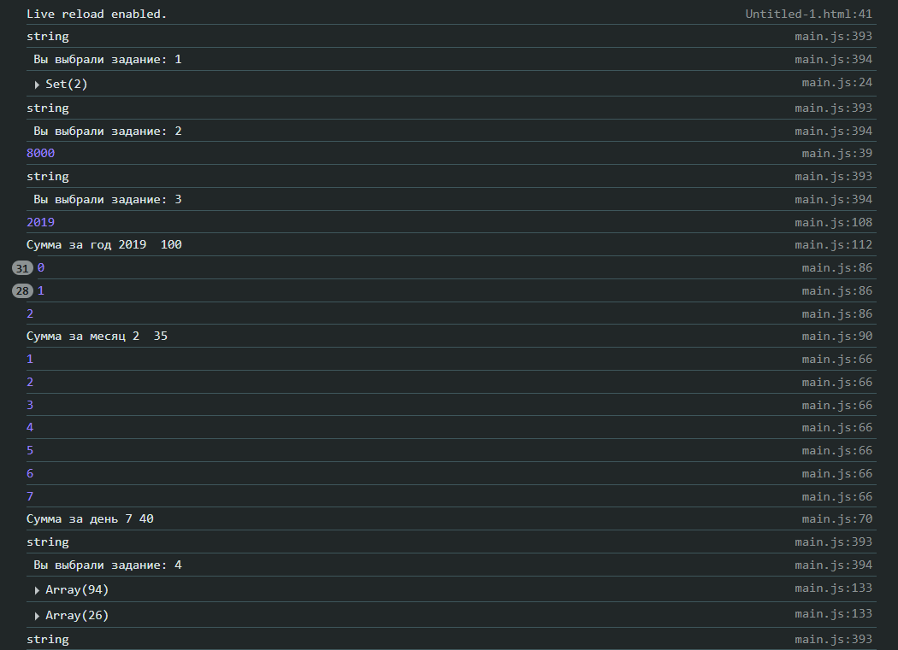
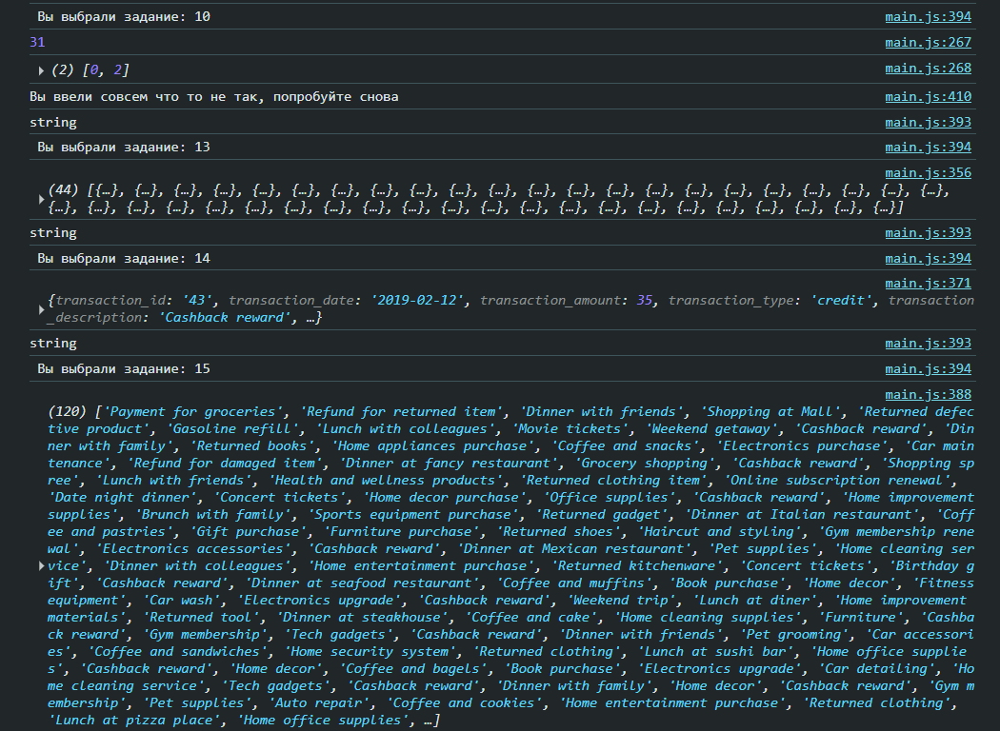

# Лабораторная работа №2. Основы работы с массивами, функциями и объектами в JavaScript
Борисенко Дарья IA2403

## Цель лабораторной работы
Изучить основы работы с массивами и функциями в JavaScript, применяя их для обработки и анализа транзакций.

## Оглавление
* Шаг 1. Создание массива транзакций
* Шаг 2. Реализация функций для анализа транзакций
* Шаг 3. Тестирование функций

## Шаг 1. Создание массива транзакций
* Создайте файл main.js для размещения вашего кода.
* Создайте массив объектов с транзакциями. Каждая транзакция должна содержать следующие свойства:
    
    * transaction_id - уникальный идентификатор транзакции.
    * transaction_date - дата транзакции.
    * transaction_amount - сумма транзакции.
    * transaction_type - тип транзакции (приход или расход).
    * transaction_description - описание транзакции.
    * merchant_name - название магазина или сервиса.
    * card_type - тип карты (кредитная или дебетовая).

## Шаг 2. Создание массива транзакций

### 1. `getUniqueTransactionTypes(transactions)`

* Возвращает массив уникальных типов транзакций.
* Используйте Set() для выполнения задания.

``` javaScript 
    function getUniqueTransactionTypes(transactions)
    {
        let outTrans=new Set();
        for (let i = 0; i < transactions.length; i++){

                outTrans.add(transactions[i].transaction_type);
        }
        console.log(outTrans);
        return outTrans;
    }
```
### 2. `calculateTotalAmount(transactions)`
* Вычисляет сумму всех транзакций.

```javaScript 
    function calculateTotalAmount(transactions)
    {
        let summ = 0; 
        for (let i=0 ; i< transactions.length; i++ )
        {
            summ = summ+transactions[i].transaction_amount;
        }
        console.log(summ);
        return summ;
    }
```
### 3. `calculateTotalAmountByDate(transactions, year, month, day)`
* Вычисляет общую сумму транзакций за указанный год, месяц и день.
* Параметры year, month и day являются необязательными.
* В случае отсутствия одного из параметров, метод производит расчет по остальным.

```javaScript
    function calculateTotalAmountByDate(transactions, year="", month="", day="")
    {
    let summ= 0;
    if (year =="")
    {
        if (month=="")
        {
            if (day=="")
            {
                calculateTotalAmount(transactions);    
            }
            else
            {
                for(let i=0; i<transactions.length; i++)
                {
                    let dayDate = new Date((transactions[i].transaction_date)).getDate();
                    console.log(dayDate);
                    if(dayDate == day)
                    {
                        summ = summ+ transactions[i].transaction_amount;
                        console.log(`Сумма за день ${day} ${summ}`);
                        return summ;
                        }
                    }
                }
            }
            else
            {
                for(let i=0; i<transactions.length; i++)
                {
                    let dateMonth = new Date((transactions[i].transaction_date)).getMonth();
                    console.log(dateMonth);
                    if(dateMonth == month)
                    {
                        summ = summ+ transactions[i].transaction_amount;
                        console.log(`Сумма за месяц ${month}  ${summ}`);
                        return summ;
                    }
                }
            }
        }
        else
        {
            for(let i=0; i<transactions.length; i++)
            {
                let yearDate = new Date ((transactions[i].transaction_date)).getFullYear();
                console.log(yearDate);
                if(yearDate == year)
                {
                    summ = summ+ transactions[i].transaction_amount;
                    console.log(`Сумма за год ${year}  ${summ}`);
                    return summ;
                }

            }    
        }
    }
```
### 4. `getTransactionByType(transactions, type)`
* Возвращает транзакции указанного типа (debit или credit).
```javaScript
    function getTransactionByType(transactions, type)
    {
        let typeArray = transactions.filter(transaction => transaction.transaction_type == type);  
        console.log(typeArray);
        return typeArray;
    }
```
### 5. `getTransactionsInDateRange(transactions, startDate, endDate)`
* Возвращает массив транзакций, проведенных в указанном диапазоне дат от `startDate` до `endDate`.
```javaScript
    function getTransactionsInDateRange(transactions, startDate, endDate)
    {
        let transactionsByDate = [];
        for (let i= 0; i< transactions.length; i++)
        {
        let transactiondate = new Date(transactions[i].transaction_date);
           if (transactiondate> startDate && transactiondate < endDate)
           {
            transactionsByDate.push(transactions[i]);
           }
        }
        console.log(transactionsByDate);
        return transactionsByDate;
    }
```
### 6. `getTransactionsByMerchant(transactions, merchantName)`
* Возвращает массив транзакций, совершенных с указанным `merchantName`.
```javaScript
    function getTransactionsByMerchant(transactions, merchantName)
    {
        let arrayOfTrans = [];
        for (let i =0 ; i< transactions.length; i++)
        {
            if (transactions[i].length==0)
            {
                console.log("Нет подходящих транзакций ");
            }
            else
            {
                if (transactions[i].merchant_name == merchantName)
                {
                    arrayOfTrans.push(transactions[i]);
                }
            }
        }
        console.log(arrayOfTrans);
        return arrayOfTrans;
    }
```
### 7. `calculateAverageTransactionAmount(transactions)`
* Возвращает среднее значение транзакций.
```javaScript
    function calculateAverageTransactionAmount(transactions)
    {
        let summ= 0;
        for( let i=0 ; i< transactions.length; i++)
        {
            summ = summ + transactions[i].transaction_amount;
        }
        console.log(summ/ transactions.length);
        return summ / transactions.length;
    }
```
### 8. `getTransactionsByAmountRange(transactions, minAmount, maxAmount)`
* Возвращает массив транзакций с суммой в заданном диапазоне от `minAmount` до `maxAmount`.
```javaScript
    function getTransactionsByAmountRange(transactions, minAmount, maxAmount)
    {
        let arrayTrans = [];
        for (let i=0 ; i<transactions.length; i++)
        {
            if (transactions[i].transaction_amount >= minAmount && transactions[i].transaction_amount <= maxAmount)
            {
                arrayTrans.push(transactions[i]);
            }
        }
        console.log (arrayTrans);
        return arrayTrans;
    }
```

### 9. `calculateTotalDebitAmount(transactions)`
* Вычисляет общую сумму дебетовых транзакций.
```javaScript
    function calculateTotalDebitAmount(transactions)
    {
        let summ = 0;
        for (let i =0; i<transactions.length; i++)
        {
            if (transactions[i].transaction_type === "debit")
            {
                summ = summ + transactions[i].transaction_amount;
            }
        }
        console.log(summ);
        return summ; 
    }
```
### 10. `findMostTransactionsMonth(transactions)`
* Возвращает месяц, в котором было больше всего транзакций.
```javaScript
    function findMostTransactionsMonth(transactions)
    {
        let monthArray = [];
        for(let i=0; i<transactions.length; i++)
        {
            let date = new Date(transactions[i].transaction_date).getMonth();
            if (!monthArray[date]) {
                monthArray[date] = 0;
            }
            monthArray[date]++;
        }
        let maxTransactions = Math.max(...monthArray);
        let MonthWithMaxTransaction = [];
        for (let i=0; i<transactions.length; i++)
        {
            if(monthArray[i]=== maxTransactions)
            {
                MonthWithMaxTransaction.push(i);
            }
        } 
        console.log(maxTransactions);
        console.log(MonthWithMaxTransaction);
        return MonthWithMaxTransaction;
    }
```

### 11. `findMostDebitTransactionMonth(transactions)`
*  Возвращает месяц, в котором было больше дебетовых транзакций.
```javaScript
    function findMostDebitTransactionMonth(transactions)
    {
        let monthArray = [];
        for(let i=0; i<transactions.length; i++)
        {
            if(transactions[i].transaction_type ==="debit")
            {
                let date = new Date(transactions[i].transaction_date).getMonth();
                if (!monthArray[date]) {
                    monthArray[date] = 0;
                }
                monthArray[date]++;
            } 
        }
        let maxTransactions = Math.max(...monthArray);
        let MonthWithMaxTransaction = [];
        for (let i=0; i<transactions.length; i++)
        {
            if(monthArray[i]=== maxTransactions)
            {
                MonthWithMaxTransaction.push(i);
            }
        } 
        console.log(maxTransactions);
        console.log(MonthWithMaxTransaction);
        return MonthWithMaxTransaction;
    }
```
### 12. `mostTransactionTypes(transactions)`
* Возвращает каких транзакций больше всего.
* Возвращает `debit`, если дебетовых.
* Возвращает `credit`, если кредитовых.
* Возвращает `equal`, если количество равно.
```javaScript
    function mostTransactionTypes(transactions)
    {
        let arrayWithNumOfTrans = [0,0];
        for(let i =0; i< transactions.length; i++)
        {
            if(transactions[i].transaction_type==="debit")
            {
                arrayWithNumOfTrans[0] ++;
            }
            else if (transactions[i].transaction_type==="credit")
            {
                arrayWithNumOfTrans[1] ++;
            }
        }
        console.log(` debit ${arrayWithNumOfTrans[0]}`);
        console.log(` credit ${arrayWithNumOfTrans[1]}`);
        if (arrayWithNumOfTrans[0] > arrayWithNumOfTrans[1])
        {
            console.log("debit");
            return "debit";
        }
        else if(arrayWithNumOfTrans[0] === arrayWithNumOfTrans[1])
        {
            console.log("equal");
            return "equal";
        }
        else 
        {
            console.log("credit");
            return "credit";
        }
    }
```
### 13. `getTransactionsBeforeDate(transactions, date)` 
* Возвращает массив транзакций, совершенных до указанной даты.
```javaScript
    function getTransactionsBeforeDate(transactions, date)
    {
        let arrayTrans= [];
        for(let i=0; i<transactions.length; i++)
        {
            if(transactions[i].transaction_date< date)
            {
                arrayTrans.push(transactions[i]);
            }
        }
        console.log(arrayTrans);
        return arrayTrans;
    }
```
### 14. `findTransactionById(transactions, id)` 
* Возвращает транзакцию по ее уникальному идентификатору (`id`).
```javaScript
     function findTransactionById(transactions, id)
    {
        for(let i=0 ; i<transactions.length; i++)
        {
            if(transactions[i].transaction_id=== id)
            {
                console.log(transactions[i]);
                return transactions[i];
            }
        }
    }
```
### 15. `mapTransactionDescriptions(transactions)`
* Возвращает новый массив, содержащий только описания транзакций.
```javaScript
    function mapTransactionDescriptions(transactions)
    {
        let arrayOfTransDescript = [];
        for ( let i=0; i<transactions.length; i++)
        {
            arrayOfTransDescript.push(transactions[i].transaction_description);
        }
        console.log(arrayOfTransDescript);
        return arrayOfTransDescript;
    }
```
## Шаг 3. Тестирование функций
* Создайте массив транзакций и протестируйте все функции.
* Выведите результаты в консоль.



* Проверьте работу функций на различных наборах данных.
* Проверьте работу функций на пустом массиве транзакций [extra].
* Проверьте работу функций на массиве транзакций с одной транзакцией [extra].

#### Меню для навигации
```javaScript 
    switch (Number(numOfTask))
    {
        case 1:
            getUniqueTransactionTypes(transactions);
            mainMenuAsc();
            break;
        case 2:
            calculateTotalAmount(transactions);
            mainMenuAsc();
            break;
        case 3:
            calculateTotalAmountByDate(transactions,"2019", "","")
            calculateTotalAmountByDate(transactions, "", "2", "")
            calculateTotalAmountByDate(transactions, "", "", "7")
            mainMenuAsc();
            break;
        case 4:
            getTransactionByType(transactions, "debit");
            getTransactionByType(transactions, "credit");
            mainMenuAsc();
            break;
        case 5:
            getTransactionsInDateRange(transactions, new Date(2019, 1 ,1 ), new Date(2020, 9, 11));
            mainMenuAsc();
            break;
        case 6:
            getTransactionsByMerchant(transactions,"RetailStore456");
            mainMenuAsc();
            break;
        case 7:
            calculateAverageTransactionAmount(transactions);
            mainMenuAsc();
            break;
        case 8:    
            getTransactionsByAmountRange(transactions, prompt("Введите минимальную сумму"), prompt("Введите максимальную сумму"));
            mainMenuAsc();
            break; 
        case 9:
            calculateTotalDebitAmount(transactions);
            mainMenuAsc();
            break; 
        case 10:
            findMostTransactionsMonth(transactions);
            mainMenuAsc();
            break;
        case 11:
            findMostDebitTransactionMonth(transactions);
            mainMenuAsc();
            break;
        case 12:
            mostTransactionTypes(transactions);
            mainMenuAsc();
            break;
        case 13:
            getTransactionsBeforeDate(transactions, "2019-02-14");
            mainMenuAsc();
            break;
        case 14:
            findTransactionById(transactions, "43");
            mainMenuAsc();
            break;
        case 15:
            mapTransactionDescriptions(transactions);
            mainMenuAsc();
            break;
    }
```
## Контрольные вопросы
* Какие методы массивов можно использовать для обработки объектов в JavaScript?
* Как сравнивать даты в строковом формате в JavaScript?
* В чем разница между `map()`, `filter()` и `reduce()` при работе с массивами объектов?