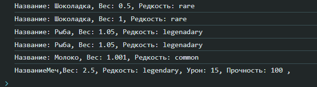

# Лабораторная работа номер 3 " Продвинутые объекты в JavaScript"
# Цель работы

Познакомиться с классами и объектами в JavaScript, научиться создавать классы, использовать конструкторы и методы, а также реализовать наследование.

# Условие

Создайте консольное приложение, моделирующее систему инвентаря, где можно добавлять предметы, изменять их свойства и управлять ими.

## Шаг 1. Создание класса Item

Создайте класс Item, который будет представлять предмет в инвентаре.

### Поля класса 
•  name – название предмета.

• weight – вес предмета.

•  rarity – редкость предмета (common, uncommon, rare, legendary).

### Методы 
```getInfo()``` – возвращает строку с информацией о предмете.

```setWeight(newWeight)``` – изменяет вес предмета.
### Пример кода 
``` javaScript
class Item {
     /**
     * Создает объект Item.
     * @param {string} name - Название предмета.
     * @param {number} weight - Вес предмета.
     * @param {string} rarity - Редкость предмета.
     */
    name;
    weight;
    rarity;
    /**
     * Конструктор объект Item.
     * @param {string} name - Название предмета.
     * @param {number} weight - Вес предмета.
     * @param {string} rarity - Редкость предмета.
     */
    constructor(name, weight, rarity) 
    {
        this.name = name;
        this.weight = weight;
        this.rarity = rarity;
    }
    /**
     * Метод получает информацию о предмете.
     * @returns {string} Строка с информацией о предмете.
     */
    getInfo() 
    {
        return `Название: ${this.name}, Вес: ${this.weight}, Редкость: ${this.rarity}`;
    }
    /**
     * Метод устанавливает новый вес предмета.
     * @param {number} weight - Новый вес предмета.
     */
    setWeight(weight) 
    {
        this.weight = weight;
    }
}


```


## Шаг 2. Создание класса Weapon

Создайте класс Weapon, который расширяет Item.

### Дополнительные поля:
•  damage – урон оружия.

•  durability – прочность (от 0 до 100).

### Методы: 

•  ```use()``` – уменьшает durability на 10 (если durability > 0).

•  ```repair()``` – восстанавливает durability до 100.

### Пример кода 
``` javaScript 
   
/**
 * Класс, представляющий оружие, унаследованное от Item.
 */
class Weapon extends Item {
    damage;
    durability;

    /**
     * Создает объект Weapon.
     * @param {string} name - Название оружия.
     * @param {number} weight - Вес оружия.
     * @param {string} rarity - Редкость оружия.
     * @param {number} damage - Урон оружия.
     * @param {number} durability - Прочность оружия.
     */

    constructor(name, weight, rarity, damage, durability)
    {
        super(name, weight, rarity);
        this.damage = damage;
        this.durability = durability;
    }

    /**
     * Использует оружие, уменьшает прочность на 10.
     */
    use()
    {
        if (this.durability > 0)
        {
            this.durability-=10;
        }
        else{
            console.log("Кажестся его жизнь кончена");
        }
    }

    /**
     * Ремонтирует оружие, восстанавливает прочность до 100.
     */
    repair() 
    {
        if ( this.durability === 100)
        {
            console.log("Максимальная прочность");
        }
        else
        {
            this.durability = 100;
            console.log("вы починили оружие");
        }
        
    }
    /**
     * Получает полную информацию об оружии.
     * @returns {string} Строка с информацией о предмете и оружии.
     */
      getInfo() {
      return `${super.getInfo()}, Урон: ${this.damage}, Прочность: ${this.durability}`;
  }

}
```


## Шаг 3. Тестирование

•  Создайте несколько объектов классов Item и Weapon.

•  Вызовите их методы, чтобы убедиться в правильности работы.

### Работа кода

