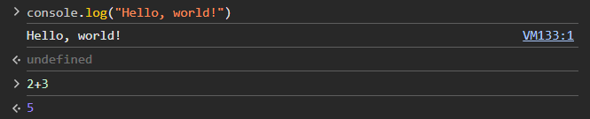
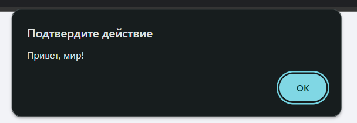
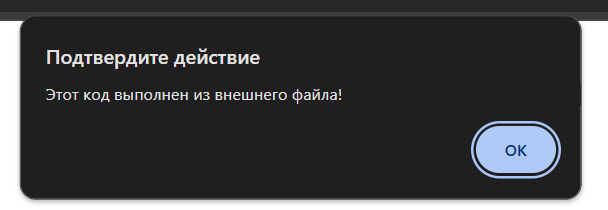

# Лабораторная работа № 1, введение в JavaScript 
Борисенко Дарья IA2403

## Задание 1
#### Пункт 2 
* Открываем в браузере консоль (F12 ->Console )
* Пишем команду `console.log("Hello, world!");`
* Пишем в консоли 2+3 и смотрим результат 
```JavaScript
    console.log("Hello, world!")
    2+3
```
#### Результат


## Задание 1
#### Пункт 3
* Создаем html страничку и вставляем в нее предложенный код 
* Создаем файл `index.html` и вставляем туда данный код html:
```HTML
 <!DOCTYPE html>
   <html lang="en">
     <head>
       <title>Привет, мир!</title>
     </head>
     <body>
       <script>
         alert("Привет, мир!");
         console.log("Hello, console!");
       </script>
     </body>
   </html>
```
* Открываем код в браузере и смотрем результат выполнения


## Задание 1
#### Пункт 4
* Создаем .js файл и вставляем в него код, предложенный ниже
```JavaScript
alert("Этот код выполнен из внешнего файла!");
   console.log("Сообщение в консоли");
```
* Подключаем файл .js к .html, добавив в тег `<head>` данный код 
```HTML
   <script src="script.js"></script>
```
#### Результат



## Задание 2
#### Пункт 1
Работа с переменными
* Обьявляем переменных: 
  * `name` - строка с именем 
  * `birthYear` - число, год вашего рождения.
  * `isStudent` - логическая переменная, указывающая, являетесь ли вы студентом.
* Выведем их в консоль
```JavaScript
let name ="Даша";
let birthYear = 2006;
let isStudent = true ;
console.log(name) ;
console.log(birthYear);
console.log(isStudent);
```
#### Результат


## Задание 2
#### Пункт 2
Условия и циклы 
* Добавляем следующий код в `script.js` : 
```JavaScript
let score = prompt("Введите ваш балл:");
   if (score >= 90) {
     console.log("Отлично!");
   } else if (score >= 70) {
     console.log("Хорошо");
   } else {
     console.log("Можно лучше!");
   }

   for (let i = 1; i <= 5; i++) {
     console.log(`Итерация: ${i}`);
   }
```
* Открываем страницу и наблюдаем результат


## Контрольные вопросы 
- Чем отличается `var` от `let` и `const`?
  - `let` и `const` появились в 2015 году и сеейчас являются стандартами 
  для создания переменных. `var` - устаревший способ имеющий в себе большое
  количество ошибок.
- Что такое неявное преобразование типов в JavaScript?
    - Неявное преобразование типов заключается в том, что JS
    во время выполнения операций с разными типами данных, привдит 
    их к одному типу данных, который имеет необходимые
    операции.
- Как работает оператор == в сравнении с ===?
  - Двойное равно (==) производит сравнения двух 
  выражений, проверяя только их значения, 
  к примеру “2” == 2 будет true. 
  Тройное равно (===) производит сравнение 
  не только по значению, но и по типу данных, 
  где результатом предыдущего сравнения будет false. 
